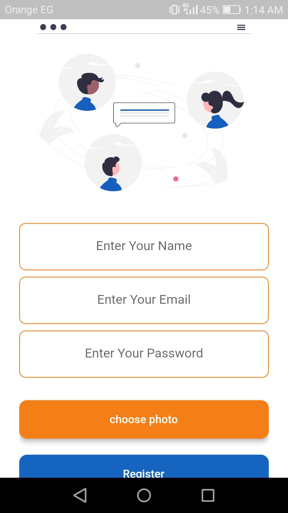
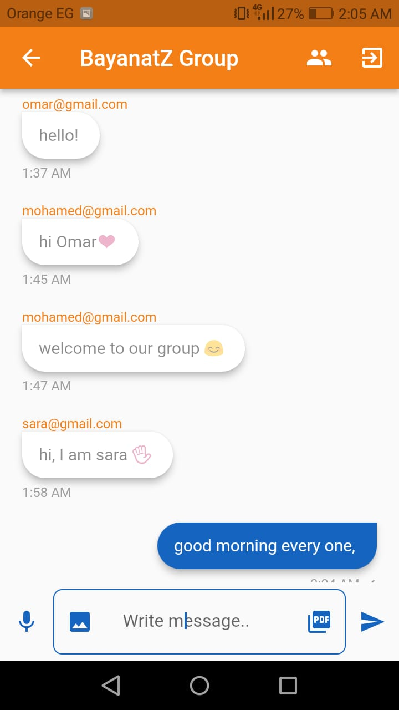
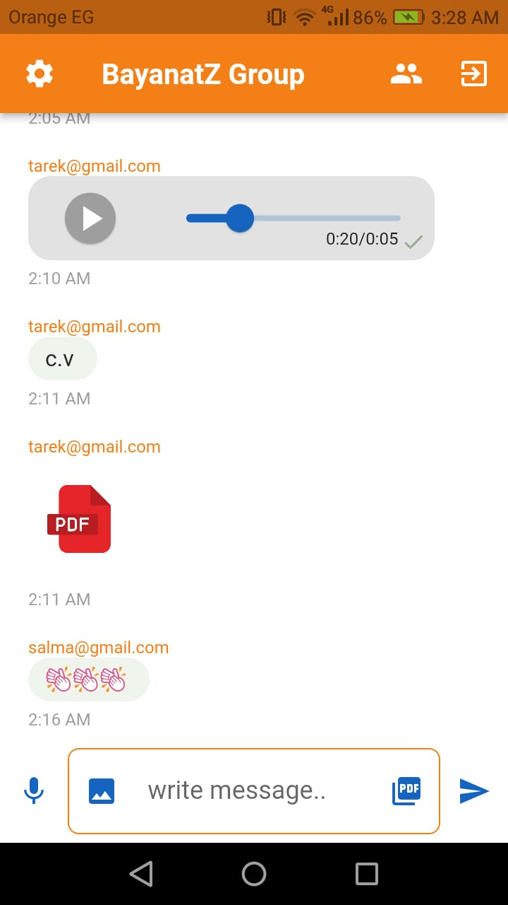
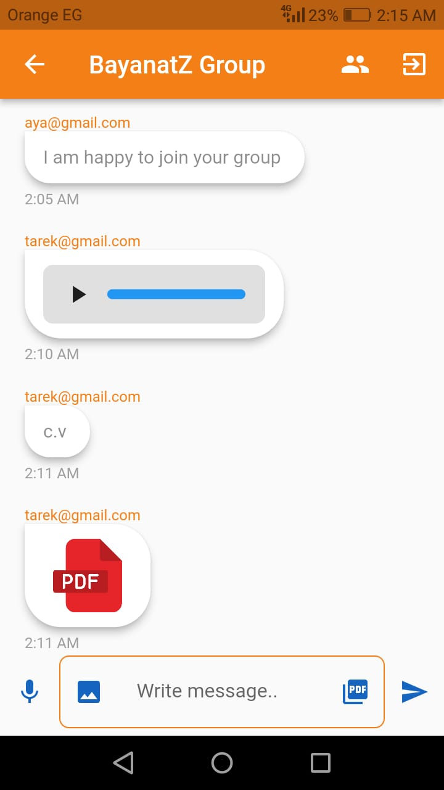

• Group Chat App using Firebase in Flutter

This is a Flutter application for a group chat that uses Firebase as the backend.
The app allows users to chat with other users who are part of the same group.

• Features:

o  User authentication using email and password.

o  FireStorage for storing images, PDF files, and  voice notes.

o  FireStore to store messages and user data.

o  Real-time messaging within groups.

o  bloc to manage data.

o  Sending images, voice notes, and PDF content.

o  Confirming the recipient of the message with check marks.

• Screenshots

Here are some screenshots of the app:

o Splash Screen

o Welcome Screen

o Register Screen

o Login Screen

o Users Screen

o Chat Screen

• Setup

To run this app on your local machine, follow these steps:

1- Clone this repository using the command git clone https://github.com/MohamedFouad99/chat_group.git

2- In the Firebase console, create a new project and enable the Firestore and Authentication services.

3- Copy the google-services.json file from your Firebase project and replace the existing one in the android/app directory.

4- Run flutter pub get to install the necessary dependencies.

5- Run the app using flutter run.

• Dependencies

 o audioplayers: ^3.0.1
 
 
 o bloc: ^8.1.1
 
 
 o cloud_firestore: ^4.4.4
 
 
 o file_picker: ^5.2.6
 
 
 o firebase_auth: ^4.2.10
 
 
 o firebase_core: ^2.7.1
 
 
 o firebase_storage: ^11.0.15
 

 o flutter_bloc: ^8.1.2
 
 
 o flutter_svg: ^1.1.6
 

 o image_picker: ^0.8.7
 
 
 o path_provider: ^2.0.13
 
 
 o record: ^4.4.4
 
 
 o url_launcher: ^6.1.10
 
 

• Contributions

Contributions to this project are welcome! 

If you find any issues or have suggestions for new features, please open an issue or a pull request.

