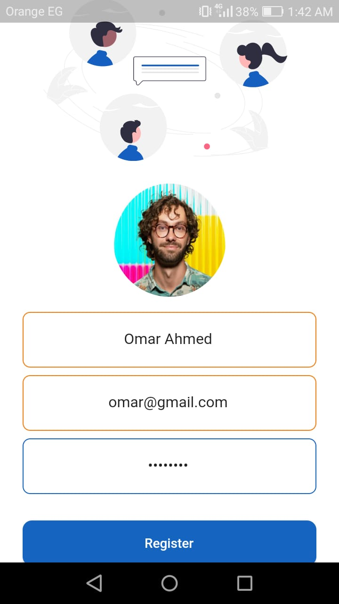
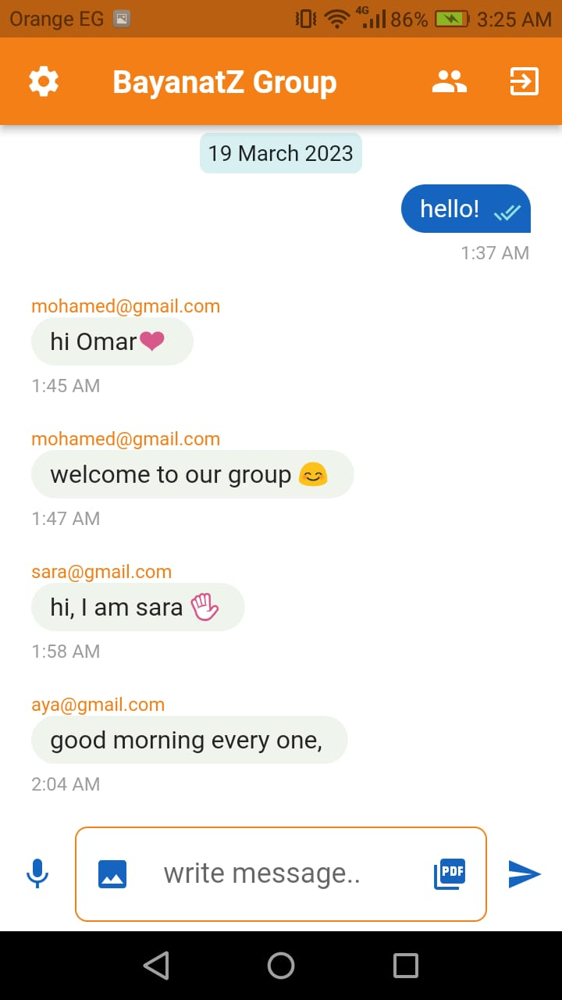

• Group Chat App using Firebase in Flutter

This is a Flutter application for a group chat that uses Firebase as the backend.
The app allows users to chat with other users who are part of the same group.

• Features:

o  User authentication using email and password.

o  FireStorage for storing images, PDF files, and  voice notes.

o  FireStore to store messages and user data.

o  Real-time messaging within groups.

o  bloc to manage data.

o  Sending images, voice notes, and PDF content.

o  Confirming the recipient of the message with check marks.

• Screenshots

Here are some screenshots of the app:

o Splash Screen

 It is an initial screen that appears for a number of seconds.

o Welcome Screen

 It displays a welcome screen with a logo and two buttons for sign-in and registration.
 
 The logo is an SVG image that is scaled based on the screen size.
 
 Two buttons, one for signing in and the other for registration.

o Register Screen

 It contains form fields for user registration data,
 
 such as name, email, password, and profile picture. The user can register by
 
 filling out the form and clicking the "register" button, which triggers a 
 
 registration process via a RegisterCubit bloc.
 
 The widget listens to the RegisterState changes and displays a loading
 
 indicator while waiting for the registration process to complete. If the
 
 registration is successful, the widget navigates the user to the chat screen
 
 and shows a success message. If the registration fails, an error message is displayed.
 

o Login Screen

 sign-in screen and contains form fields for email and password, along with a
 
 login button. It has a formKey property of type GlobalKey<FormState> for validation purposes.
 
 It also uses BlocConsumer to consume state changes from a SignInCubit. Based on
 
 the state changes, the screen updates its UI and shows a loading indicator when
 
 the user tries to log in.
 
 When the user successfully logs in, it navigates to the ChatScreen. In case of
 
 any failure, it shows an error message through a snack bar.

o Users Screen

To Displays all members of the group.

 
o Settings Screen
 

o Chat Screen

• Setup

To run this app on your local machine, follow these steps:

1- Clone this repository using the command git clone https://github.com/MohamedFouad99/chat_group.git

2- In the Firebase console, create a new project and enable the Firestore and Authentication services.

3- Copy the google-services.json file from your Firebase project and replace the existing one in the android/app directory.

4- Run flutter pub get to install the necessary dependencies.

5- Run the app using flutter run.

• Dependencies

 o audioplayers: ^3.0.1
 
 
 o bloc: ^8.1.1
 
 
 o cloud_firestore: ^4.4.4
 
 
 o file_picker: ^5.2.6
 
 
 o firebase_auth: ^4.2.10
 
 
 o firebase_core: ^2.7.1
 
 
 o firebase_storage: ^11.0.15
 

 o flutter_bloc: ^8.1.2
 
 
 o flutter_svg: ^1.1.6
 

 o image_picker: ^0.8.7
 
 
 o path_provider: ^2.0.13
 
 
 o record: ^4.4.4
 
 
 o url_launcher: ^6.1.10
 
 

• Contributions

Contributions to this project are welcome! 

If you find any issues or have suggestions for new features, please open an issue or a pull request.

